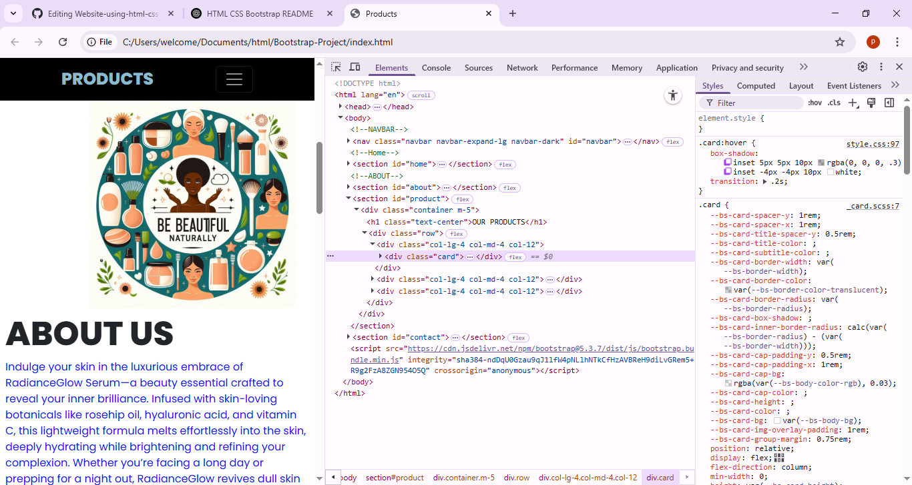
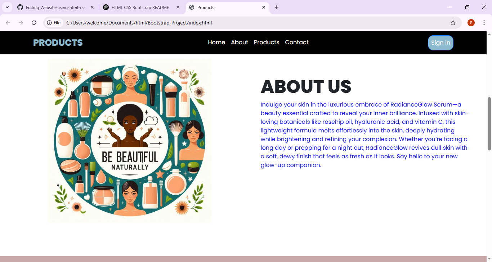
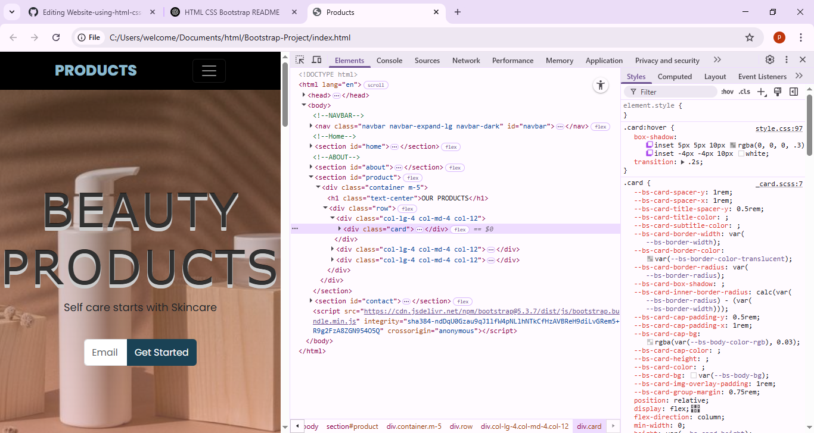

# Website-using-html-css-and-Bootstrap
# 🌐 Simple Responsive Website

A modern and responsive website built with **HTML5**, **CSS3**, and **Bootstrap 5**. Perfect for learning or quick prototyping.

---

## ✨ Features

- ✅ Fully responsive layout
- 🎨 Clean and modern design
- ⚡ Fast and lightweight
- 📱 Mobile-friendly with Bootstrap

---

## 🛠️ Tech Stack

- **HTML5**
- **CSS3**
- **Bootstrap 5**

---

## 📁 Folder Structure

/project-folder
├── index.html
├── /css
│ └── styles.css
├── /js
│ └── script.js (optional)
└── /images

---

## 🚀 Getting Started

1. **Download or clone** the repository:
   ```bash
   git clone https://github.com/your-username/your-repo-name.git
Open index.html in your browser.

💡 Customization Tips
Edit styles.css to apply your custom styles.

Use Bootstrap components to add more sections like navbars, cards, or forms.

Replace images in the /images folder with your own.

📸 Preview



🙌 Author
Made with ❤️ by Prabha M


